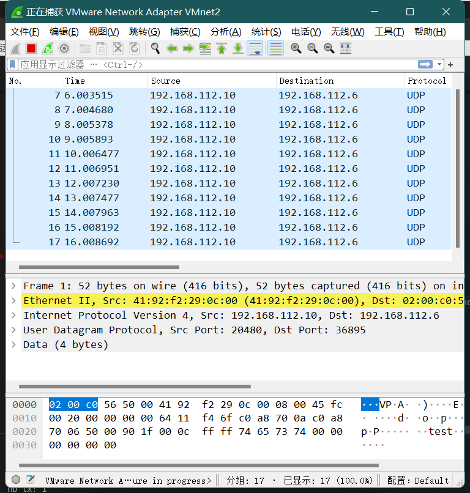

# Lab 2

袁航宇 518030910096
allen_yuan@sjtu.edu.cn

## Part 1: Get familiar with DPDK

### Q1: What's the purpose of using hugepage?

> DPDK supports both of these page sizes. With those page sizes, it is much easier to cover large memory areas without (as many) TLB misses. Fewer TLB misses, in turn, leads to better performance when working with large memory areas, as is customary for DPDK use cases.
>
> [Memory in DPDK, Part 1: General Concepts - DPDK](https://www.dpdk.org/blog/2019/08/21/memory-in-dpdk-part-1-general-concepts/)

大页可以使 TLB 内对应的页对应覆盖更多的内存空间，即可以有效减少 TLB miss，在需要利用很大内存空间来工作时可以有更好的性能。

### Q2: Take examples/helloworld as an example, describe the execution flow of DPDK programs?

> The Environment Abstraction Layer (EAL) is responsible for gaining access to low-level resources such as hardware and memory space. It provides a generic interface that hides the environment specifics from the applications and libraries. It is the responsibility of the initialization routine to decide how to allocate these resources (that is, memory space, devices, timers, consoles, and so on).
>
> [3. Environment Abstraction Layer — Data Plane Development Kit 22.03.0-rc2 documentation (dpdk.org)](http://doc.dpdk.org/guides/prog_guide/env_abstraction_layer.html)

rte_eal_init 首先进行了一系列必要的初始化。

```c++
	ret = rte_eal_init(argc, argv);
	if (ret < 0)
		rte_panic("Cannot init EAL\n");
```

然后 RTE_LCORE_FOREACH_WORKER 遍历所有 EAL 指定可以使用 lcore，通过 rte_eal_remote_launch 在每个 lcore 上，启动指定的线程。

```c++
	/* call lcore_hello() on every worker lcore */
	RTE_LCORE_FOREACH_WORKER(lcore_id) {
		rte_eal_remote_launch(lcore_hello, NULL, lcore_id);
	}
```

在函数 rte_eal_remote_launch(lcore_function_t *f, void *arg, unsigned int worker_id)中，第一个参数是从线程要调用的函数，第二个参数是调用的函数的参数，第三个参数是指定的逻辑核。

lcore_hello 获取 lcore_id 并输出字符串。

```c++
static int
lcore_hello(__rte_unused void *arg)
{
	unsigned lcore_id;
	lcore_id = rte_lcore_id();
	printf("hello from core %u\n", lcore_id);
	return 0;
}
```

最后在 main lcore 也输出一次

```c++
	/* call it on main lcore too */
	lcore_hello(NULL);
```

收尾工作。回收线程，clean up。

```c++
	rte_eal_mp_wait_lcore();

	/* clean up the EAL */
	rte_eal_cleanup();
```

### Q3: Read the codes of examples/skeleton, describe DPDK APIs related to sending and receiving packets.

- Create a mbuf pool.

  This function creates and initializes a packet mbuf pool. It is a wrapper to rte_mempool functions.

  ```c++

  struct rte_mempool *
  rte_pktmbuf_pool_create(const char *name, unsigned int n,
  unsigned int cache_size, uint16_t priv_size, uint16_t data_room_size,
      int socket_id)

  ```

- Retrieve a burst of input packets from a receive queue of an Ethernet device. The retrieved packets are stored in rte_mbuf structures whose pointers are supplied in the rx_pkts array.

  ```c++
  static inline uint16_t rte_eth_rx_burst(uint16_t port_id, uint16_t queue_id, struct rte_mbuf **rx_pkts, const uint16_t nb_pkts)
  ```

- Send a burst of output packets on a transmit queue of an Ethernet device.

  ```c++
  static inline uint16_t rte_eth_tx_burst(uint16_t port_id, uint16_t queue_id, struct rte_mbuf **tx_pkts, uint16_t nb_pkts)
  ```

### Q4: Describe the data structure of 'rte_mbuf'.

Fields 太多，这里直接放上链接：http://doc.dpdk.org/api-20.11/structrte__mbuf.html

结构是 https://doc.dpdk.org/guides-20.11/prog_guide/mbuf_lib.html

大体来说，就是先是 struct rte_mbuf，然后是 headroom，随后是 data，随后是 tailroom。

多个 rte_mbuf 也可以被 chain 在一起。

## Part 2: send packets with DPDK

我在 payload 填的内容是"test"。

```c++
void *payload = rte_pktmbuf_mtod_offset(mbuf, void*, sizeof(struct rte_ether_hdr)+sizeof(struct rte_ipv4_hdr)+sizeof(struct rte_udp_hdr));
memcpy(payload, "test", 4);
```



可以看到 wireshark 抓到了自己设置的 ip 地址发送/收到的 UDP 包，data 大小 4bytes，下方可看到内容是 test。
